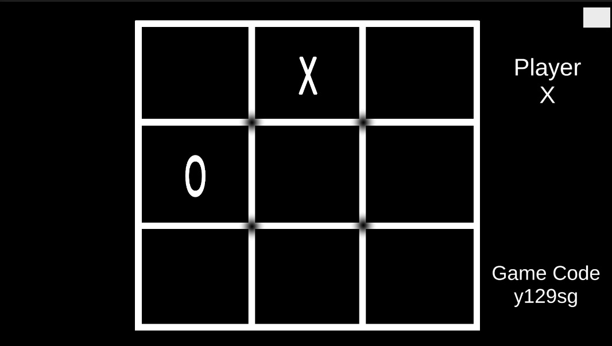

# Cloud DB Quick Start

English 

## Table of Contents

 * [Introduction](#introduction)
 * [Getting Started](#getting-started)
 * [Result](#result)
 * [License](#license)
 
## Introduction

This project is a quick start sample developed using Cloud DB APIs.

## Getting Started

1. On the [AppGallery Connect](https://developer.huawei.com/consumer/en/service/josp/agc/index.html#/myApp) page, create a project, and add an app with a package named **com.huawei.agc.clouddb.xxxx**.

2. Go to **Auth Service** and enable Auth Service and the anonymous account authentication mode.

3. Go to **Cloud DB** and enable Cloud DB. Then, perform the following operations:

    3.1 Create an object type by importing the template file **UnityCloudDB.json** in the root directory of the project. 

    3.2 Click the **Cloud DB Zones** tab, and click **Add** to create a Cloud DB zone named **QuickStartDemo**.

4. Go to **Project settings** > **General information**, download the **agconnect-services.json** file, and copy this file to the **Assets/Resources** directory.

5. Use Unity 2020 or later version to open the project.

6. Run the sample on your device.

## Result

## License

The sample code is licensed under the [Apache License, version 2.0](https://www.apache.org/licenses/LICENSE-2.0).